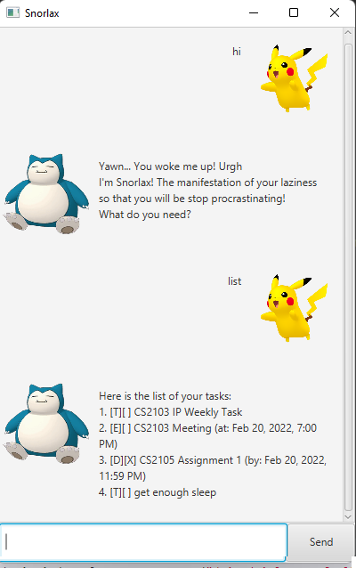

# User Guide

Snorlax is a desktop app for you to manage your **tasks** and **contacts** so that you will **stop procrastinating** 
and **get things** done! Through an interactive Graphical User Interface (GUI), managing upcoming events and 
deadlines will never be the same again!

## User Interface

## Features 

### Managing Tasks

`list` - list out all your tasks  
`todo` - add a Todo task  
`deadline` - add a Deadline task in the form of '{task} /by {datetime}'  
`event` - add an Event task in the form of '{task} /at {datetime}'  
`mark` - mark task as done  
`unmark` - mark task as undone  
`delete` - delete task  
`find` - find task in task list  
`manage contacts` - switch to manage contacts  

### Managing contacts

`list` - list out all your contacts  
`add` - add a contact in the form of '{name} {number}'  
`update` - update a contact in the form of '{name} {number}'  
`delete` - delete contact  
`manage tasks` - switch to manage tasks  

## Usage

### Listing all your tasks : `list` when in Managing Tasks mode

List all tasks.  
If task starts with `[T]`, it is a `Todo` task.  
If task starts with `[E]`, it is an `Event` task.  
If task starts with `[D]`, it is a `Deadline` task.   
If task has `[X]`, it means task is already done.  
If task has `[X]`, it means task is not done yet.

Format: `manage tasks` then `list`

### Add a task : `todo` `deadline` or `event`

Adds a task. Task can be `todo`, `deadline` or `event`  

Format:  
* `todo sleep early`
* `deadline CS3244 Project /by 2022-04-04 23:59` 
* `event CS2100 Midterms /at 2022-03-03 19:00`

**Note**: Deadline must be in the format of `deadline {task} /by {date}`  
**Note**: Deadline must be in the format of `event {task} /at {date}`  
**Note**: Date must be in the format `YYYY-MM-DD HH:mm`

### Mark or unmark a task : `mark` or `unmark`

Mark a task as done or unmark a task as undone.  

Format:  
* `mark INDEX`
* `unmark INDEX`

**Note**: `INDEX` is the index of the task displayed in list.

### Delete a task : `delete`

Delete a task.  

Format:  
* `delete INDEX`

**Note**: `INDEX` is the index of the task displayed in list.

### Find a task with a specific keyword: `find`

Find tasks with the specific keyword.  

Format:  
* `find KEYWORD`

**Note**: `KEYWORD` is the word that should appear in your task name.

### Listing all your contacts : `list` when in Managing Contacts mode

List all contacts.  

Format:  
`manage contacts` then `list`

### Add a new contact : `add`

Add a new contact.  

Format:   
* `add Chris Ong 12345678`
* `add Police 999`

**Note**: Add must be in the format of `add {name} {contact number}`

### Update an existing contact : `add`

Update an existing contact number to a new contact number.  

Format:  
* `update Chris Ong 87654321`

**Note**: Update must be in the format of `update {name} {contact number}`  
**Note**: Name must be in existing contact list.

### Delete an existing contact : `delete`

Delete an existing contact.  

Format:  
* `delete INDEX`

**Note**: `INDEX` is the index of the contact displayed in contact list.

### Switch from managing contacts to managing tasks and vice versa: `manage contacts` and `manage tasks`

Switch modes of managing contacts and managing tasks.

Format:  
* `manage contacts`
* `manage tasks`

### Exiting and saving all changes: `bye`

Exits the program and save all changes made to tasks and contacts

**Note**: If you do not exit, changes made will not be saved.
